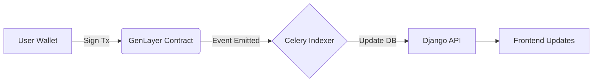
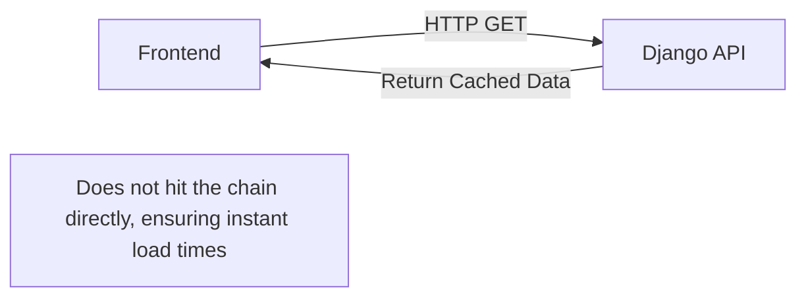

# Agora

Agora is a decentralized, AI-moderated forum platform powered by GenLayer's Intelligent Contracts. It allows users to create self-governing communities, define custom constitutions for those communities, and engage in discussions where rules are enforced autonomously by LLM consensus rather than centralized human moderators.

### 🌐 [Live Demo](https://agora-sandy.vercel.app/)

_Note: The live demo is currently running against GenLayer's **studionet**._

---

## How It Works

Agora replaces traditional human moderators with autonomous, AI-driven rule enforcement based on a community's unique constitution:

1. **Create a Community:** A user creates a new community and defines its "Constitution" (a set of natural language rules governing acceptable behavior and topics).
2. **Post & Comment:** Members engage in discussions by submitting posts and comments.
3. **Flag Violations:** If a user believes a post or comment violates the community's constitution, they can flag it by staking a portion of their reputation.
4. **AI Arbitration:** The GenLayer Intelligent Contract automatically prompts an LLM with the flagged content and the community's constitution. GenLayer's consensus mechanism determines if a violation occurred.
5. **Enforcement & Reputation:**
   - **Violation Found:** The content is marked as violating and hidden. The author is penalized and loses reputation.
   - **No Violation:** The content remains visible. The _flagger_ is penalized and loses reputation for a false report.
6. **Appeals:** Authors can appeal a moderation decision, triggering a deeper AI review or a higher-stakes consensus check.

---

## The Trust Model

Agora blends deterministic blockchain mechanics with probabilistic AI judgments to create a fair, self-moderating ecosystem.

- **What is Cryptographically Enforced:** Content ownership, timestamps, reputation balances, flagging stakes, and the execution flow are strictly deterministic and enforced on-chain.
- **What is AI-Judged:** The actual moderation—determining whether specific text violates a specific constitution—is judged by LLMs via GenLayer's consensus mechanism.

**The Power of the Constitution:**
The fairness of a community depends entirely on its constitution. Vague or ambiguous rules will lead to unpredictable AI judgments. By requiring communities to write clear, objective constitutions, Agora ensures that the AI can moderate effectively and fairly.

---

## Key Features

- **Decentralized Communities:** Anyone can create a community with its own distinct rules and focus.
- **Autonomous AI Moderation:** No human moderators needed. LLMs enforce the rules based on the community's written constitution.
- **Reputation System:** Users build reputation through positive contributions. Reputation is staked when flagging content, preventing spam flags and abuse.
- **Appeals Process:** Built-in mechanics for users to appeal AI decisions.
- **Wallet-Based Auth (SIWE):** Secure Sign-In with Ethereum for seamless, passwordless login.
- **Real-Time UX:** A fast-path Django indexer syncs contract state to a PostgreSQL database, providing web2-like speeds for browsing and reading, while keeping writes securely on-chain.
- **Notification System:** Real-time JWT-authenticated notifications for users when their content is flagged, moderated, or appealed.

---

## Architecture Overview

Agora is built as a monorepo containing three distinct layers:

1. **Contract Layer (`contracts/`):** The GenLayer Intelligent Contract written in Python (GenVM). It acts as the ultimate source of truth, managing communities, posts, reputation, and executing AI moderation logic.
2. **Backend Layer (`backend/`):** A Django application that indexes the contract state into a PostgreSQL database. It serves as a fast read-replica API for the frontend and handles off-chain features like notifications and JWT authentication.
3. **Frontend Layer (`frontend/`):** A Next.js App Router application providing the user interface, interacting with both the Django backend for fast reads and the GenLayer blockchain for executing write transactions.

### Data Flow

**Write Action (e.g., Creating a Post or Flagging):**



**Read Action (e.g., Browsing a Community):**



---

## Tech Stack

| Layer        | Technologies Used                                                        |
| :----------- | :----------------------------------------------------------------------- |
| **Contract** | Python, GenVM                                                            |
| **Backend**  | Django 6.1, PostgreSQL, Redis, Celery (Worker & Beat), PyJWT, Gunicorn   |
| **Frontend** | Next.js 16.3, TypeScript, Tailwind CSS, Base UI, wagmi/viem, genlayer-js |

---

## Local Development Setup

To run the full stack locally, you will need multiple terminal windows.

### 1. Contract (GenLayer Studio)

Install the `genlayer` CLI if you haven't already.

```bash
cd contracts
genlayer up
```

This starts the local GenLayer simulator and deploys the contracts. Make sure to copy the deployed contract address for your environment variables.

### 2. Backend (Django)

Ensure you have Python 3.12+, PostgreSQL, and Redis installed and running.

```bash
cd backend
python -m venv venv
source venv/bin/activate
pip install -r requirements.txt

# Run migrations
python manage.py migrate

# Start the Django server
python manage.py runserver

# In separate terminals, start the Celery workers:
celery -A core worker -l info
celery -A core beat -l info
```

### 3. Frontend (Next.js)

Ensure you have Node.js 20+ installed.

```bash
cd frontend
npm install
npm run dev
```

The app will be available at `http://localhost:3000`.

---

## Project Structure

```text
agora/
├── contracts/      # GenLayer Intelligent Contracts (forum.py)
├── backend/        # Django REST API, indexer, JWT auth, and Celery tasks
└── frontend/       # Next.js web application and Shadcn UI components
```

---

## Security & Scalability

- **Single-Container Deployment:** Optimized `start.sh` for deploying Django, Celery Worker, and Celery Beat in a single memory-constrained container
- **JWT Authentication:** Off-chain API routes (like notifications) are secured via Sign-In with Ethereum (SIWE) and JWTs, ensuring only the wallet owner can clear or view their notifications.
- **Robust AI JSON Parsing:** The GenVM contract includes resilient parsing logic to handle LLM markdown fences and irregular outputs during moderation consensus.
- **CORS & Host Security:** Django is configured with strict `ALLOWED_HOSTS` and `CORS_ALLOWED_ORIGINS` tailored for the production environment.

---

## Known Limitations

- **Network Environment:** The application currently points to GenLayer's `studionet` as its production environment.
- **Wallet Support:** Wallet sign-in and transactions are heavily optimized for **MetaMask**. Other wallets may experience unexpected behavior during SIWE flows or GenLayer network switching.

---

## License

This project is licensed under the MIT License.
