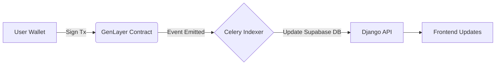

# Agora

Agora is a decentralized, AI-moderated forum platform powered by GenLayer's Intelligent Contracts. It allows users to create self-governing communities, define custom constitutions for those communities, and engage in discussions where rules are enforced autonomously by LLM consensus rather than centralized human moderators.

### 🌐 [Live Demo](https://agora-sandy.vercel.app/)

_Note: The live demo is configured to run against the GenLayer Testnet / Studionet environments._

---

## 🧠 How It Works

Agora replaces traditional human moderators with autonomous, AI-driven rule enforcement based on a community's unique constitution:

1. **Create a Community:** A user creates a new community and defines its "Constitution" (a set of natural language rules governing acceptable behavior and topics).
2. **Post & Comment:** Members engage in discussions by submitting posts and comments.
3. **Flag Violations:** If a user believes a post or comment violates the community's constitution, they can flag it by staking a portion of their reputation.
4. **AI Arbitration:** The GenLayer Intelligent Contract automatically prompts an LLM with the flagged content and the community's constitution. GenLayer's consensus mechanism determines if a violation occurred.
5. **Enforcement & Reputation:**
   - **Violation Found:** The content is marked as violating and hidden. The author is penalized and loses reputation.
   - **No Violation:** The content remains visible. The _flagger_ is penalized and loses reputation for a false report.
6. **Appeals:** Authors can appeal a moderation decision, triggering a deeper AI review or a higher-stakes consensus check.

---

## 🛡️ The Trust Model & Sybil Resistance

Agora blends deterministic blockchain mechanics with probabilistic AI judgments to create a fair, self-moderating ecosystem.

- **What is Cryptographically Enforced:** Content ownership, timestamps, reputation balances, flagging stakes, and the execution flow are strictly deterministic and enforced on-chain.
- **What is AI-Judged:** The actual moderation—determining whether specific text violates a specific constitution—is judged by LLMs via GenLayer's `EquivalencePrinciple` consensus mechanism.

**Sybil Resistance:**
To prevent bad actors from spinning up hundreds of new wallets to spam false flags and drain the AI moderation resources, Agora employs strict, on-chain Sybil resistance:

- **`min_flag_age` Gating:** Users cannot flag content immediately upon joining. They must first participate (post/comment) and wait a community-defined minimum age before they are trusted to submit flags.
- **Frontend Prevention:** The UI preemptively queries the user's join time and the community config directly from the contract, blocking the UI flag button and providing clear feedback on exactly when they will be eligible.

---

## ✨ Key Features

- **Decentralized Communities:** Anyone can create a community with its own distinct rules and focus.
- **Autonomous AI Moderation:** No human moderators needed. LLMs enforce the rules based on the community's written constitution.
- **Reputation Economics:** Users build reputation through positive contributions. Reputation is staked when flagging content, preventing spam flags and abuse.
- **Optimized Caching & UX:** A fast-path Django indexer syncs contract state to a PostgreSQL database, providing web2-like speeds for browsing. The frontend employs Promise-deduplication caching to share GenLayer reads across components, preventing rate-limiting on complex screens.
- **Wallet-Based Auth (SIWE):** Secure Sign-In with Ethereum for seamless, passwordless login to protect off-chain features (like notifications).
- **Fail-Closed Polling:** Resilient frontend transaction polling that safely catches contract reverts and GenLayer network timeouts without leaving the user in an infinite loading state.

---

## 🏗️ Architecture & Deployment

Agora is built as a monorepo containing three distinct layers, architected for a modern managed-service deployment (Vercel + Render + Supabase + Upstash):

1. **Contract Layer (`contracts/`):** The GenLayer Intelligent Contract written in Python (GenVM). It acts as the ultimate source of truth, managing communities, posts, reputation, and executing AI moderation logic.
2. **Backend Layer (`backend/`):** A Django application running on **Render**. It uses **Supabase** (PostgreSQL) for indexing the contract state, and **Upstash** (Redis) as a broker for Celery worker and beat tasks to manage background syncing.
3. **Frontend Layer (`frontend/`):** A Next.js App Router application deployed on **Vercel**, interacting with both the Django backend for fast reads and the GenLayer blockchain for executing write transactions.

### Data Flow (Write Actions)



---

## 🧪 Smart Contract Testing

The GenVM contract (`contracts/forum.py`) includes a comprehensive automated test suite leveraging the `gltest` framework.

To run the tests:

```bash
cd contracts
pytest tests/ -v
```

This suite verifies community creation, reputation economics, the AI moderation flow, Sybil resistance constraints (`min_flag_age`), and cooldown limitations.

---

## 💻 Local Development Setup

To run the full stack locally, you will need multiple terminal windows.

### 1. Contract (GenLayer Studio)

Install the `genlayer` CLI if you haven't already.

```bash
cd contracts
genlayer up
```

This starts the local GenLayer simulator and deploys the contracts. Copy the deployed contract address to your `.env` files.

### 2. Backend (Django + Celery)

Ensure you have Python 3.12+, PostgreSQL, and Redis installed and running locally.

```bash
cd backend
python -m venv venv
source venv/bin/activate
pip install -r requirements.txt

# Run migrations
python manage.py migrate

# Start the Django server
python manage.py runserver 0.0.0.0:8000

# In separate terminals, start the Celery workers:
celery -A core worker -l info
celery -A core beat -l info
```

### 3. Frontend (Next.js)

Ensure you have Node.js 20+ installed.

```bash
cd frontend
npm install
npm run dev
```

The app will be available at `http://localhost:3000`.

---

## 📄 License

This project is licensed under the MIT License.
